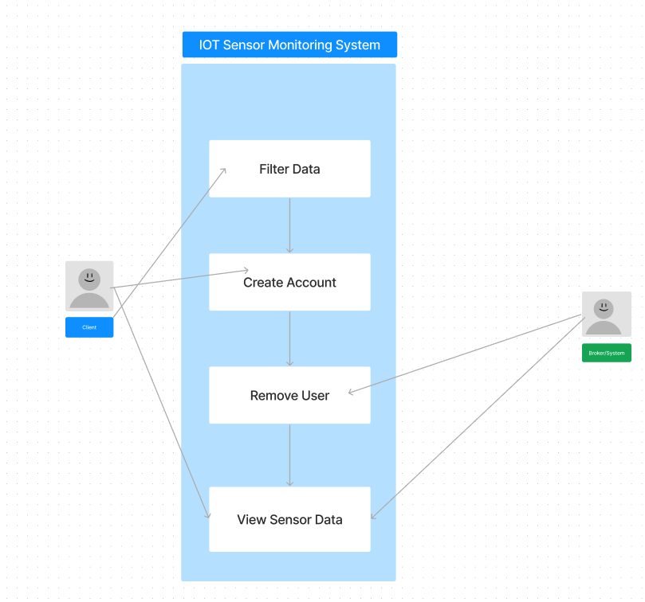
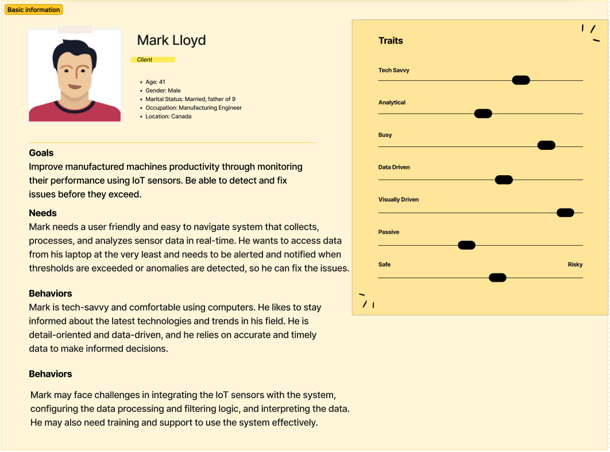

# The Project: BC ParkSense Hub IoT Monitoring System

# Launching a Django Project

### 1. Clone repository:
**`git clone https://github.com/aryanagn/IoT-Sensor-Project.git`** 

### 2. Set Up a Virtual Environment (Optional but Recommended):

- cd to sensinggang folder
- python -m venv venv
### On Windows:
venv\Scripts\activate
### On macOS/Linux:
source venv/bin/activate

### 3. Install Django & project dependencies
**`pip install django`** 
**`pip install -r requirements.txt`** 

### 4. Run migrations
**`python manage.py migrate`** 

### 5. Run server
**`python manage.py runserver`**

The server should be running at http://127.0.0.1:8000/ by default.

# IoT Sensor Monitoring System

IoT Sensor Monitoring system is an application that allows users to take advantage of the IoT and the MQTT network in order to monitor sensors in BC Parks without the need for additional set up beyond account creation and the subscription to their data-streams of choice. This application will take on the roles of the web-broker and the client in the MQTT protocol entities, thereby simplifying the data acquisition process for the user. Our system will be subscribed to the sensors set up in BC Parks, the data from which will be stored in our database. The user can choose to view data from specific sensors from within that set, and can make choices on how that data is represented and set thresholds on the data streams which, if exceeded, will send them a notification. Our system will be data agnostic, meaning it will be able to support most data formats, allowing users to select from a wide variety of sensors and to have that data represented in ways relevant to the user for that sensor type, with that customizability further expanded by the choices the user can make upon selecting which data to view. In other words, the data type and the parameters set by the user will determine the graphical representation of that data. Users will be able to create an account, set which data streams are of interest and how they want that data to be displayed in its “widget” on their home page. After the account is created, users will be able to modify the widgets of their home page, both in the way the data is represented and by removing or adding data streams. 

## Users:

- Client (primary)
- Admin

## Function Requirements:

- Data collection  - collect data from IoT devices
- Notification/Alerts - alert users when thresholds are exceeded or encountered
- Process data - provide meaningful results from collected data
    - Display data (graphs, etc)
    - Export data in relevant formats (csv, JSON, etc)
- Store Data- store the collected data in a database
- Remote Monitoring - User can choose which sensors they wish to monitor
- Requires account to view data

## Non-functional Requirements:

- Secure Data - Ensure privacy/security of data collected from sensors
    - Data is collected, handled, and stored in a secure and private manner
- Usability of System - Implement user interface that is intuitive and easy to use/navigate by the user
    - user interface is similar to that of other common UIs
    - 
- Maintainability of the system - System should be easy to maintain and update over time to ensure that it remains secure against new threats and vulnerabilities. (Security)
    - Modularity - Components of system can be easily upgraded or replaced without affecting the whole system; thus, allowing for easy updates and maintenance.
- Performance/Efficiency - System should be able to withstand high traffic (data volume) and perform to its best capabilities
- Reliable - Consistence performance according to its specifications with little to none issues and failures
- The application should allow them to access data without needing an advanced understanding of the technology as would traditionally be required to access data from the IoT. Application allows users to take advantage of the IoT and the MQTT network in order to monitor sensors in BC Parks without the need for additional set up beyond account creation and the subscription to their data-streams of choice.

# Use cases:

## **Use Case 1. View Sensor Data**

**Primary actor:**  Client

**Description:**  Process of a client setting up a widget with the data they want to monitor on their home page

**Pre-condition:** User must login and have a valid account, system must already be subscribed to sensor

**Post-condition:** The client views the sensor data of their choosing in their home page, displayed per the parameters they set, and thresholds monitoring and notification is set

### Main scenario:

1. Client Logs in or creates an account (Use case 2)
2. Client goes to the Sensor data page
3. Client filters or “subscribes” to the sensor data that they would like to see
4. Client can select specific sensors and the web application displays data and graphical visualizations from said sensor/sensors.
5. Client can set thresholds
6. Client can select the date range of the data being shown.
7. Widget appears on their home page

### Extensions:

1a. Client tries to view data without an account

1a1. Displays message that client must login or create an account

2a. Cannot access sensor data page

2a1. Displays error and informs client they cannot access that data/page

## **Use Case 2. Create Account**

**Primary actor:**  Client

**Description:**  Process of creating an account to view/access the system 

**Pre-conditions:**  The user must have access to the system's user interface and must not have an account in the system

**Post-condition:** The user’s account has been created and information is stored securely in the database.

### Main scenario:

1. The user accesses the system's user interface.
2. The user clicks on the "Create Account" button.
3. The system displays a form for the user to enter their account information, including their name, email address, and password.
4. The user enters their account information and clicks the "Create" button.
5. The system validates the user's information and checks if the password/email is unique.
6. If the user's information is valid, the system creates an account for the user and stores their information securely in the database.
7. The system displays a confirmation message to the user, indicating that their account has been created successfully.

### Extensions:

1a. Client enters invalid information in the form (weak password or invalid email)

1a1. system displays an error message and prompts the user to correct their information before proceeding.

2a. Client enters email that is already registered or associated with another account

2a2. Displays error message and prompt user to enter a different email address

## **Use Case 3. Login/Log out**

**Primary actor:**  Client

**Description:**  Allow user to log in and out of the IoT monitor sensor system

**Pre-conditions:**  The user must have an account created on the system.

**Post-condition:** The user is logged out of the IoT monitor sensor system and cannot access the sensor data or perform any system functions until they log in again.

### Main scenario:

1. The user launches the IoT monitor sensor system application.
2. The system prompts the user to enter their login credentials.
3. The user enters their login credentials and submits them to the system (Use case 2).
4. The system verifies the user's credentials and logs the user in.
5. The user can now access the sensor data and perform other system functions.
6. When the user is done using the system, they can choose to log out.
7. The system logs the user out and returns to the login screen.

### Extensions:

4a. Client enters invalid information in the form (incorrect username or password)

4a1. system displays an error message and alerts the user to correct their information so they can access the system.

## **Use Case 4. Database Connectivity**

**Primary actor:**  System admin

**Description:**  Process of connecting the IoT monitor sensor system to a database for data analysis and storage.

**Pre-conditions:**  The system must be accessible on the machine and a database has been set up/configured to receive information from sensors. 

**Post-condition:** The system is set up and through a connection to the database and is able to store and retrieve sensor data as needed. 

### Main scenario:

1. The system administrator logs into the IoT monitor sensor system.
2. The system administrator navigates to the "Database Connectivity" section of the system settings.
3. The system administrator selects the type of database that will be used for data storage and analysis (e.g. MySQL, MongoDB, etc.).
4. The system administrator enters the necessary database connection information, such as the database server address, port number, username, and password.
5. The system administrator tests the database connection to ensure that the IoT monitor sensor system can communicate with the database.
6. The system administrator saves the database connection settings.
7. The IoT monitor sensor system is now connected to the database and can store and retrieve sensor data as needed.

### Extensions:

  5a. Database connection fails or is unable to connect

5a1. System displays error connectivity message and system administrator troubleshoots connection details (database server address, and port number)

7a. IoT monitor sensor system is unable to connect to the the database. 

7a1. Display error and prompt admin to check network connectivity to ensure system communication with the database

## **********************************Use Case 5. Remove Client**********************************

**Primary actor:** Admin

**Description**: Process to allow admin to remove user account/details

**Pre-condition:** Admin is authorized to remove a user who is already registered

**Post-Condition:** Client account and details are no longer in the database

### Main Scenario:

1. User is registered (Use case 2)
2. User notifies system of account issues
3. Admin is notified and begins account removal process
4. Account is removed
5. User is notified of account removal

### Extensions:

1.1 User Account not registered

1.1.1 Return error message saying that the requested action cannot be completed

2.1 Further instructions after removal

2.1.1 If the account removal is successful, the system should notify the user that their account has been removed and provide any instructions for new account 

## **********************************Use Case 6. IoT device connection**********************************

**Primary actor:** IoT Device

**Description**: Process of an IoT device connecting to a sensor

**Pre-condition:** IoT device is powered on, functional, and has a network connection

**Post-Condition:** IoT device is able to transmit data through its sensor(s)

### Main Scenario:

1. IoT device is powered on and establishes a network connection
2. IoT device identifies available sensors within its network
3. IoT device establishes a connection with its sensor(s)
4. IoT device begins transmitting data from sensor(s) to the broker
5. IoT device will continue to receive from sensor(s) and send data to the broker until connection is terminated.

### Extensions:

1.1 IoT device is not on

1.1.1 Cannot connect to sensor(s) or send data. Will send message that it needs to be turned on

2.1 IoT device cannot establish connection to broker

2.1.1 Will be unable to select sensor data from that IoT device until valid connection is made.

## **Use Case 7. Account Management**

**Primary actor:**  Client

**Description:**  Allow user to manage their account details such as username and password

**Pre-conditions:**  The user must have an account created on the system.

**Post-condition:** The user has new account details that will be reflected in the database.

### Main scenario:

1. The user launches the IoT monitor sensor system application.
2. The system prompts the user to enter their login credentials.
3. The user enters their login credentials and submits them to the system (Use case 2).
4. The system verifies the user's credentials and logs the user in.
5. The user can now select their account and click “manage details”.
6. When the user is done changing desired details, they can save or cancel.
7. The system returns to home login page

### Extensions:

1a. Client enters invalid information in the form (incorrect username or password format)

1a1. system displays an error message and alerts the user to use correct format

2a. Client enters username currently used

2a1. system displays an error message and informs user that username is in use

## **Use Case 8. IoT Device Publishing of Data**

**Primary actor:**  IoT Device

**Description:** Process of a broker establishing a connection with the IoT device so it can publish the data.

**Pre-condition:** IoT device is on, has a network connection, and establishes connection with broker

**Post-condition:** IoT device publishes the data to the broker which then stores that data into the IoT database

### Main scenario:

1. IoT device generates the data based on its sensor readings.
2. A connection is established between the IoT device and the central system uses a routing method/protocol such as MQTT 
3. The system grabs that data and encodes it into a lightweight format for data storage/transmission such as JSON. 
4. The system receives that data and stores it into the main database

### Extensions:

1a. Data is not the correct format

1a1. Change to JSON format

2a. Connection errors

2a1. Displays message for invalid connection from broker to IoT device.

## Proto-personas:

### Client:

The client is someone who’s interested in this particular sub-set of data from the IoT, is tech savvy, and has the desire to configure their own solution, and instead wants a curated picture of what a set of sensors has collected. 
